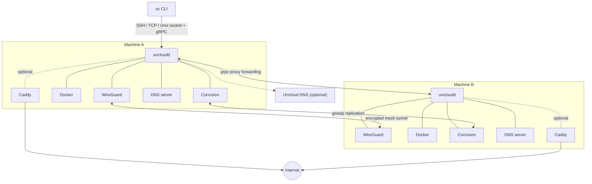
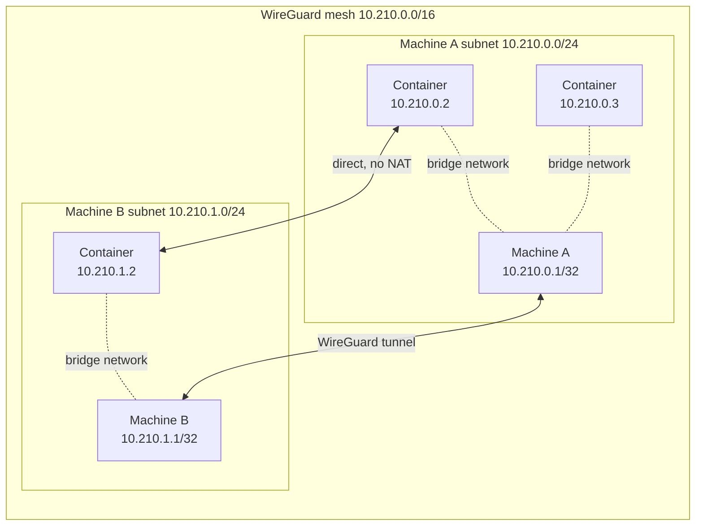
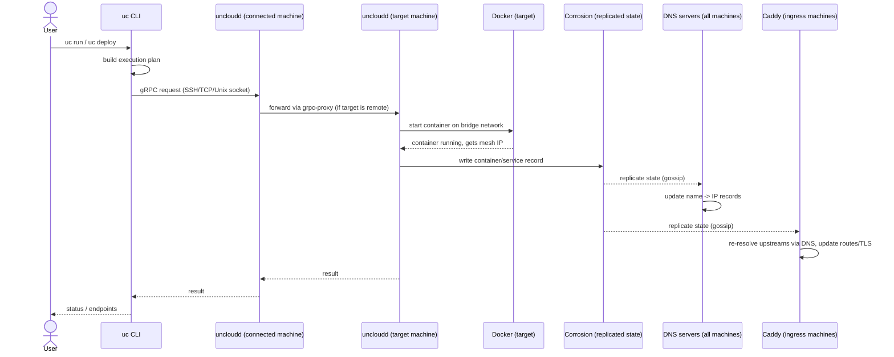

# Uncloud architecture overview

This document summarises the high-level architecture of Uncloud for anyone getting familiar with the codebase. For the
underlying design rationale and tradeoffs, see [`misc/design.md`](../misc/design.md).

## What Uncloud is

Uncloud is a lightweight clustering and container orchestration tool. It lets you deploy and manage Docker Compose
based web applications across cloud VMs, dedicated servers, and bare metal machines. It has no central control plane.
Every machine in a cluster holds the same replicated state and can accept commands, so there's no quorum to maintain
and no single point of failure.

## Core components

Uncloud is made of a small set of cooperating processes. Each machine runs the same stack.

| Component | What it does |
|---|---|
| `uc` (CLI) | The user-facing tool. Talks to a machine's `uncloudd` daemon over SSH, TCP, or a local Unix socket. |
| `uncloudd` (daemon) | Go binary running on every machine. Owns the WireGuard network, the local Docker containers, the DNS server, and the gRPC API. |
| Corrosion | A CRDT-based distributed SQLite database (from Fly.io) that replicates cluster state between machines using a gossip protocol. Runs as a Docker container managed by `uncloudd`. |
| Caddy | Reverse proxy deployed as a service on machines with the ingress role. Provides automatic HTTPS via Let's Encrypt and routes traffic to service containers. |
| WireGuard | Provides the encrypted mesh network connecting all machines and containers. |

The daemon (`internal/daemon`) is a thin wrapper that starts a `machine.Machine` (`internal/machine/machine.go`), which
wires together all the subsystems below.

## Network architecture

Uncloud replaces the concept of a "cluster" with a "network" of machines, similar to Tailscale, but implemented as a
flat WireGuard mesh that the daemon configures automatically:

- The whole mesh network uses a `/16` CIDR (e.g. `10.210.0.0/16`).
- Each machine is allocated its own `/24` subnet (e.g. `10.210.0.0/24`, `10.210.1.0/24`, ...).
- The machine itself takes the first address in its subnet (`10.210.X.1/32` on its WireGuard interface).
- Containers get addresses from the rest of the subnet (`10.210.X.2-254`) via a Docker bridge network attached to the
  WireGuard interface.

Because containers get cluster-unique IPs, they can talk to each other directly, across machines, without NAT or
published ports. Peer discovery and NAT traversal are handled automatically (`internal/machine/network`), inspired by
Talos's KubeSpan design, so machines behind firewalls or on different providers can still connect.

When a new machine joins, it only needs to establish a WireGuard tunnel with one existing machine. The rest of the
mesh learns about the new peer through the replicated cluster state and connects to it automatically.

## State management

Cluster state (machines, services, containers, DNS records, secrets, etc.) is stored in Corrosion
(`internal/corrosion`, `internal/machine/store`), a distributed SQLite database built on CRDTs. Key properties:

- **Eventually consistent**: every machine keeps a full local copy of the state and can read and write it
  independently.
- **Gossip-based replication**: updates propagate peer-to-peer, so there's no leader and no single point of failure.
- **Partition tolerant**: if the network splits, each partition keeps working with the state it has, and the state
  reconciles automatically once the partition heals.

This favors availability and partition tolerance over strict consistency (AP over CA in CAP theorem terms), which is
an intentional tradeoff given the target use case is small-to-medium deployments, not internet-scale systems.

## Orchestration model

Uncloud favors imperative operations over declarative reconciliation wherever practical. Instead of maintaining a
desired-state spec that a controller continuously reconciles (as Kubernetes does), commands like `uc run` or
`uc deploy` connect to a target machine, ask it to act directly (start a container, pull an image, etc.), and report
back success or failure immediately. This trades some of the resilience of a reconciliation loop for predictability
and simpler failure handling: you know exactly what happened when a command returns.

Some things are still handled reactively through the shared state, because it's the more reliable approach:

- **DNS records** update automatically as containers start and stop.
- **Caddy configuration** updates automatically as services are added, removed, or rescheduled.

Docker itself still supervises container health and restarts on each machine, but Uncloud does not move containers
between machines automatically. Scheduling is only ever initiated by a user command.

### Machine API and cross-machine calls

Each `uncloudd` exposes a gRPC API (`internal/machine/api/pb`) with services for machine info, cluster membership,
Docker container/image management, and Caddy configuration. The CLI usually talks to one machine directly, but any
`uncloudd` can proxy a gRPC call to any other machine in the cluster using
[`grpc-proxy`](https://github.com/siderolabs/grpc-proxy) (`internal/machine/api/proxy`). This is how, for example,
`uc run` on one machine can ask a *different* machine to actually start a container: the daemon you're connected to
forwards the request over the mesh network to the target machine's daemon.

## Service discovery

Every machine runs an embedded DNS server (`internal/machine/dns`) that resolves machine, container, and service
names to their mesh IP addresses. It watches the replicated cluster state and updates its records as containers come
and go. Example name patterns:

| DNS name | Resolves to |
|---|---|
| `<machine-name>.machine.internal` | Mesh IP of the machine |
| `<container-name>.<machine-name>.machine.internal` | Mesh IP of a specific container on a machine |
| `<service-name>.internal` | Mesh IPs of all containers backing a service |
| `lb.<service-name>.internal` | A virtual/load-balanced IP for the service |

## Ingress and HTTPS

Machines assigned an ingress role run Caddy (`internal/machine/caddyconfig`) as a service in Compose's `global` mode.
Caddy discovers services through the internal DNS server and automatically requests and renews TLS certificates via
Let's Encrypt. If the network partitions, DNS records adjust to only the containers reachable in that partition, and
Caddy follows suit by re-resolving its upstreams.

Uncloud also offers an optional managed DNS service (`internal/dns`, backed by the external
[Uncloud DNS](https://github.com/psviderski/uncloud-dns) project) that provisions free `*.<cluster-id>.uncld.dev`
subdomains pointing at internet-reachable machines running Caddy, so services can get a working public HTTPS URL
without the user configuring their own DNS.

## Deployment flow, end to end

A representative walk-through of `uc run` / `uc deploy`, tying the pieces above together:

1. The CLI (`pkg/client`) resolves which machine(s) should run the service and builds an execution plan
   (`pkg/client/deploy`, `pkg/client/compose`).
2. The CLI sends the request to the `uncloudd` it's connected to (SSH tunnel, TCP, or Unix socket).
3. If the target machine is different, that daemon forwards the gRPC call to the target machine's daemon over the
   mesh network via `grpc-proxy`.
4. The target daemon starts the container using the local Docker daemon (`internal/machine/docker`) on the
   machine-specific bridge network, and records the container in the replicated cluster state
   (`internal/machine/store`).
5. The container's IP becomes reachable from any machine in the mesh immediately.
6. DNS servers on every machine pick up the new container from the replicated state and update their records.
7. Caddy (if the service publishes a port) picks up the new/changed service via DNS and updates its routing and TLS
   configuration.

No step here requires a central coordinator: every machine involved is reacting to the same replicated state or to a
direct request forwarded over the mesh.

## Subsystem overview

A tour of every package that makes up Uncloud, grouped by area.

### Entry points (`cmd/`)

| Package | Purpose |
|---|---|
| `cmd/uc` | The `uc` CLI binary: command tree for machine, service, volume, DNS, and context management. |
| `cmd/uncloudd` | The machine daemon binary that runs on every cluster machine. |
| `cmd/ucind` | "Uncloud in Docker": spins up local multi-machine clusters inside Docker containers for development and e2e testing. |

### Machine daemon core (`internal/machine`)

| Package | Purpose |
|---|---|
| `machine` (root) | Wires together networking, Docker, Corrosion, DNS, Caddy, and the gRPC API into one running machine process; owns machine startup/shutdown and persisted local state. |
| `machine/api/pb` | Protobuf/gRPC definitions for the Machine, Cluster, Docker, and Caddy services exposed by every `uncloudd`. |
| `machine/api/proxy` | Forwards gRPC calls transparently from the machine you're connected to, to any other machine in the cluster, using `grpc-proxy`. |
| `machine/network` | Configures the WireGuard interface, allocates subnets, manages peers, keys, MTU, and NAT traversal/peer discovery. |
| `machine/cluster` | Cluster-level state and operations: machine registry, IPAM (subnet allocation), and cluster-wide DNS bookkeeping. |
| `machine/store` | Typed read/write layer over Corrosion for containers and other cluster records. |
| `machine/corroservice` | Runs and configures the Corrosion database as a Docker-managed service on the machine. |
| `machine/corromigrate` | Schema migrations for the Corrosion database. |
| `machine/dns` | The embedded DNS server and resolver that answers machine/container/service name lookups from the replicated state. |
| `machine/docker` | Wraps the local Docker daemon to create/inspect/manage containers, images, and the machine's bridge network. |
| `machine/caddyconfig` | Generates and pushes Caddy configuration (Caddyfile/JSON) from the current set of services, and validates it against the Caddy admin API. |
| `machine/firewall` | Manages iptables/pf rules needed for the WireGuard mesh and container networking. |
| `machine/metrics` | Exposes Prometheus metrics for the machine daemon. |
| `machine/osinfo` | Collects OS/platform information reported by the machine. |
| `machine/constants` | Shared constants (paths, defaults) used across the machine packages. |

### Daemon wrapper and platform glue (`internal/`)

| Package | Purpose |
|---|---|
| `daemon` | Thin process wrapper used by `cmd/uncloudd`: starts a `machine.Machine` and signals readiness to systemd. |
| `corrosion` | Client for talking to the Corrosion HTTP API (queries, subscriptions, admin operations). |
| `dns` | Client for the optional external managed Uncloud DNS service that provisions `*.uncld.dev` records. |
| `docker` | Shared, machine-agnostic Docker helpers used by both the daemon and CLI-side code. |
| `proxy` | Generic TCP proxy used to tunnel local connections to a remote address (used for reaching a machine's Unix socket over SSH). |
| `sshexec` | Executes commands and installs Uncloud on remote machines over SSH (used by `uc machine init`/`add`). |
| `secret` | Cryptographic secret generation/handling helpers. |
| `journal` | Reads and tails log entries (e.g. systemd journal) for `uc machine logs`. |
| `log` | Structured logging setup shared across binaries. |
| `metrics` | Declares the Prometheus metrics used throughout Uncloud. |
| `grpcversion` | gRPC interceptor/helpers for exchanging and checking version compatibility between client and daemon. |
| `gitutil` | Small git helpers used by build tooling. |
| `fs` | Filesystem helpers (e.g. looking up UID/GID for the corrosion user). |
| `version` | Build/version information embedded in binaries. |
| `ucind` | Implementation behind `cmd/ucind`: provisions and manages "Uncloud in Docker" dev clusters. |
| `cli` | CLI-side support code: local config file handling, TUI progress output, log formatting, shell completion, machine helpers. |

### Public API and client (`pkg/`)

| Package | Purpose |
|---|---|
| `pkg/api` | Public, stable types shared between the CLI/client and the daemon: service/container/volume/config/secret definitions, placement, ports, errors. |
| `pkg/client` | The Go client library the CLI uses to talk to `uncloudd`: connecting, running containers, managing services/volumes/images/DNS, streaming logs. |
| `pkg/client/connector` | Establishes the transport to a machine's gRPC API: over SSH, raw TCP, a local Unix socket, or directly over WireGuard. |
| `pkg/client/deploy` | Core deployment engine: resolves what containers/volumes need to change and applies them with a chosen rollout strategy. |
| `pkg/client/compose` | Translates Docker Compose projects into Uncloud service definitions and deployment plans (`uc deploy`). |

## Project layout reference

- `cmd/uc`: CLI entry point and commands.
- `cmd/uncloudd`: Daemon entry point.
- `cmd/ucind`: "Uncloud in Docker" tooling for local development clusters.
- `internal/machine`: Core machine daemon: network, Docker integration, Corrosion/state, DNS, Caddy config, gRPC API.
- `internal/daemon`: Thin daemon wrapper used by `cmd/uncloudd`.
- `internal/corrosion`: Client for the Corrosion distributed database.
- `internal/dns`: Client for the managed Uncloud DNS service.
- `internal/docker`: Shared Docker helpers.
- `pkg/api`: Public API types shared between client and daemon.
- `pkg/client`: Client library used by the CLI to talk to `uncloudd`, including the Compose deployment engine.
- `misc/design.md`: Original design rationale and open questions.
