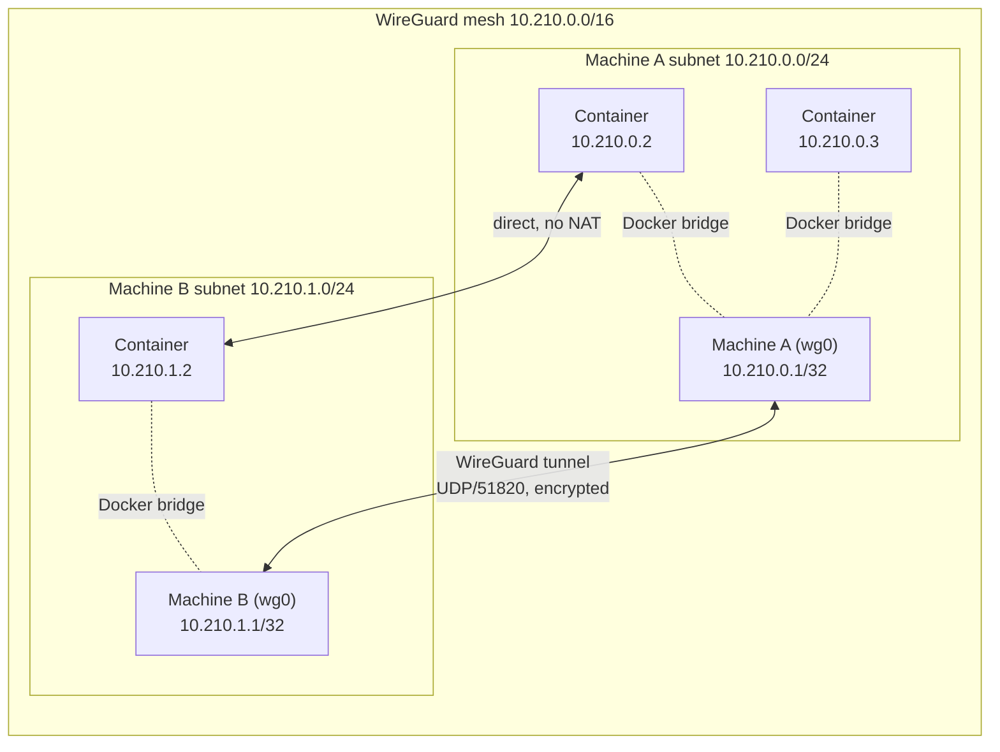

# WireGuard mesh networking

This document collects everything covered about Uncloud's networking layer: what WireGuard is, how Uncloud layers
subnetting on top of it, and where the two pieces divide responsibility. For the rest of the architecture, see
[`../architecture.md`](../architecture.md).

## What WireGuard is

WireGuard is a modern VPN protocol and set of implementations that create encrypted point-to-point tunnels between
machines, using Curve25519 for key exchange and ChaCha20-Poly1305 for encryption. Each machine generates a key pair,
peers exchange public keys and reachable endpoints, and each side sees a normal virtual network interface (`wg0`)
that routes traffic through the encrypted tunnel. Compared to IPsec or OpenVPN, it has a much smaller codebase and no
certificate negotiation.

### Is it a separate project?

Yes. WireGuard was created by **Jason A. Donenfeld** and is its own independent open-source project (part of the
Linux kernel, plus userspace implementations), unrelated to both Fly.io (which built Corrosion) and Pyotr Sviderski
(who built Uncloud). Uncloud only *consumes* it, via the official Go implementations:

```
golang.zx2c4.com/wireguard        // wireguard-go, userspace implementation
golang.zx2c4.com/wireguard/wgctrl // Go library to configure WireGuard interfaces/peers
```

(`go.mod:54-55`)

So the dependency chain is three unrelated projects glued together by Uncloud:

- **WireGuard** (Jason Donenfeld) → provides the encrypted tunnel fabric.
- **Corrosion** (Fly.io) → provides distributed state sync (see the state-sync notes below).
- **Uncloud** (Pyotr Sviderski) → wires both together with its own orchestration logic.

## What WireGuard does vs. what Uncloud adds

This is the important distinction: **WireGuard itself has no concept of "a subnet per node."** It only knows, per
peer, "encrypt/decrypt traffic to/from this public key" and "route these IP ranges (`AllowedIPs`) through this peer."
All the subnetting design is Uncloud's own IPAM logic, expressed to WireGuard through peer configuration:

```
WireGuard     = the encrypted UDP tunnel fabric between machines (no subnetting logic of its own)
Uncloud IPAM  = decides which /24 subnet each machine owns
AllowedIPs    = the glue: tells WireGuard "this subnet routes through this peer"
Docker bridge = hands out individual IPs to containers from the machine's /24
```

This is the same technique Tailscale and Talos KubeSpan use — KubeSpan is the direct design inspiration for Uncloud's
mesh (`misc/design.md`).

## Addressing scheme

- The whole mesh network uses a `/16` CIDR, e.g. `10.210.0.0/16`.
- Each machine is allocated its own `/24` subnet out of that range by Uncloud's IPAM
  (`internal/machine/cluster/ipam.go`), e.g. `10.210.0.0/24` for machine A, `10.210.1.0/24` for machine B.
- The machine's own WireGuard interface takes the first address in its subnet: `10.210.X.1/32`.
- Containers on that machine get addresses from the rest of the subnet (`10.210.X.2`–`10.210.X.254`) via a Docker
  bridge network attached to the WireGuard interface (`internal/machine/network`, `internal/machine/docker`).

Testing showed inter-container and machine routing works best when the full `/24` is assigned to the Docker bridge,
while the WireGuard interface itself only holds the single `/32` machine address.

## Ports

| Port | Protocol | Used for |
|---|---|---|
| `51820` (default, `DefaultWireGuardPort`) | UDP | WireGuard tunnel traffic between machines |

(`internal/machine/network/wireguard.go:14`)

## Peering and mesh formation

When you run `uc machine init` or `uc machine add`:

1. `internal/machine/network` generates a WireGuard key pair for the machine.
2. It creates a `wg0` interface listening on UDP port `51820` by default.
3. The machine is assigned a `/24` subnet, and `wg0` gets the `.1` address in it (e.g. `10.210.1.1/32`).
4. Peer machines exchange public keys and reachable endpoints (public IP, LAN IP, etc.) through the replicated
   cluster state (Corrosion). Each side adds the other as a WireGuard peer with `AllowedIPs` set to the peer's `/24`
   subnet.

A newly joined machine only needs to establish a tunnel with **one** existing machine. The rest of the mesh learns
about the new peer through the replicated cluster state and connects to it automatically — no manual per-pair
configuration as the cluster grows. Peer discovery and NAT traversal (for machines behind firewalls) are handled
automatically, inspired by Talos's KubeSpan design.

## Worked example

Machine A owns `10.210.0.0/24`, machine B owns `10.210.1.0/24`, and they're peered:

- A container on A gets IP `10.210.0.2` (from A's Docker bridge).
- A container on B gets IP `10.210.1.5` (from B's Docker bridge).
- Traffic from `10.210.0.2` to `10.210.1.5` leaves the Docker bridge on A, hits the `wg0` interface (because
  `10.210.1.0/24` is in `AllowedIPs` for peer B), gets encrypted, travels over UDP/51820 to B's public IP, gets
  decrypted, and lands on B's Docker bridge.

Result: direct container-to-container routing across the internet, with no NAT and no port-forwarding required on
the application side.

## Diagram



## When WireGuard is used

It's the data-plane backbone for all cross-machine traffic in a cluster:

- Container-to-container communication across machines.
- `uncloudd`'s own gRPC calls being forwarded machine-to-machine via `grpc-proxy` when a command targets a remote
  machine.
- Corrosion's gossip traffic between machines (SWIM over QUIC) also rides over the same mesh network.

It's set up once during `machine init` / `machine add` and then just runs continuously as the cluster's private
network — no further manual configuration needed as machines are added or removed.

## Related reading

- [`../architecture.md`](../architecture.md) — full system architecture, including how the network layer fits with
  Corrosion (state sync), DNS, and Caddy (ingress).
- [`../../misc/design.md`](../../misc/design.md) — original design rationale for the network-of-machines approach.
