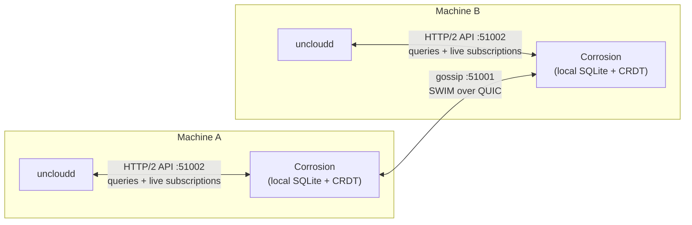

# Corrosion: distributed state sync

This document collects everything covered about Corrosion, the piece that makes "every machine holds the full
cluster state" actually work. For how this fits into the rest of the system, see
[`../architecture.md`](../architecture.md); for the network layer underneath it, see
[`../networking/wireguard-mesh.md`](../networking/wireguard-mesh.md).

## What it is

Corrosion is Fly.io's open-source project ([github.com/superfly/corrosion](https://github.com/superfly/corrosion)),
written in Rust. In one line: **"SQLite that gossips."** You write to a local SQLite database, and Corrosion
automatically propagates those writes to every other machine running Corrosion, with automatic conflict resolution.
No leader, no quorum.

### Is it open source, and who made it?

Yes, fully open source, MIT/Apache-licensed like most Fly.io projects. It's authored by **Fly.io**, unrelated to
WireGuard (Jason A. Donenfeld) or Uncloud itself (Pyotr Sviderski). Uncloud doesn't vendor or modify it — `uncloudd`
runs it unmodified as a Docker container and talks to its local HTTP API. The README credits it directly as "the
distributed SQLite database used to share Uncloud's cluster state."

## How it runs in Uncloud

It's a separate process, not a library: `uncloudd` runs it as a Docker container (`uncloud-corrosion`), managed by
`internal/machine/corroservice`. Config is written as TOML (`corroservice/config.go`) with three network surfaces:

| Port/socket | Purpose |
|---|---|
| `51001` (gossip, default `DefaultGossipPort`) | SWIM-over-QUIC traffic to other machines' Corrosion instances |
| `51002` (API, default `DefaultAPIPort`) | Local HTTP/2 API that `uncloudd` talks to |
| Admin Unix socket | Local admin operations (membership status, etc.) |

`uncloudd` never speaks the gossip protocol directly — it only ever talks to its **own local** Corrosion instance
over HTTP/2 (`internal/corrosion/client.go`), authenticated with a bearer token. Corrosion is the only thing that
gossips; everything else treats it like a local database.

## The sync protocol: two layers

**1. Membership & dissemination — SWIM over QUIC.** Each machine's Corrosion instance gossips with peers over the
gossip port. It uses the **SWIM** protocol for cluster membership and failure detection —
`internal/corrosion/admin.go:215` has a method `ClusterMembershipStates` that literally returns "the current
membership **SWIM** states of all cluster members." Transport is **QUIC** (see the `MaxMTU` comment about "QUIC's
MTU" in `corroservice/config.go:35-36`), giving encrypted, multiplexed, UDP-based streams for broadcasting change
messages between machines. This gossip traffic rides over the same WireGuard mesh as everything else.

**2. Data convergence — CRDT-based replicated SQLite.** On top of the gossip layer, Corrosion replicates a SQLite
database as a CRDT. Each row/column change is versioned per `actor_id` (effectively "which machine wrote this").
When two machines make conflicting writes to the same row, version numbers deterministically decide the winner, and
gaps get backfilled as gossip catches up. Internal bookkeeping tables track this — `__corro_bookkeeping` /
`__corro_bookkeeping_gaps` (referenced in `internal/machine/corromigrate/migrate_test.go`, and queried directly by
`store.Store.Version` / `store.Store.KnownMissingChanges` in `internal/machine/store/store.go:63-117`). Uncloud
doesn't reimplement any of this merge logic — it just relies on Corrosion's guarantee that all replicas eventually
converge to the same state.

## Talking to Corrosion locally: queries and subscriptions

`internal/corrosion/client.go`'s `APIClient` exposes two things over the local HTTP/2 API:

1. **Run a SQL query/statement** (`internal/corrosion/query.go`) — a normal read/write against the local SQLite copy.
2. **Open a live subscription** (`internal/corrosion/subscribe.go`) — give Corrosion a `SELECT` query, and it streams
   back a live feed of `ChangeEvent`s (`insert` / `update` / `delete`, with row values and a monotonic `ChangeID`)
   every time a row matching that query changes, whether the change was made locally or arrived via gossip from
   another machine. This is how the DNS server and Caddy config controller "watch" cluster state reactively instead
   of polling.

Resilience is handled deliberately at two different levels: transient HTTP errors get a short exponential-backoff
retry at the transport level (`http2MaxRetryTime`, 2s), while a broken subscription resumes from its last `ChangeID`
with its own longer backoff (`resubscribeMaxRetryTime`, 60s) — so a subscriber doesn't miss changes across a brief
Corrosion restart.

## Migration history

`internal/machine/corromigrate` exists because Corrosion's own deployment model changed over Uncloud's lifetime:
early versions ran Corrosion as a systemd unit (`uncloud-corrosion.service`, "v0.x"), while newer versions have
`uncloudd` manage it as a container ("v1.0.0"). This package detects an old-style store, dumps the durable rows to a
seed file, backs up the old directory, and lets the new version start fresh and re-seed. It's marked as a one-time
upgrade path (`TODO: remove in 0.22 assuming all pre 0.20 clusters upgraded`).

## Diagram

## Data model: what's actually stored

See [`data-model.md`](./data-model.md) for the full breakdown of every table, what data lives in it, and why.
